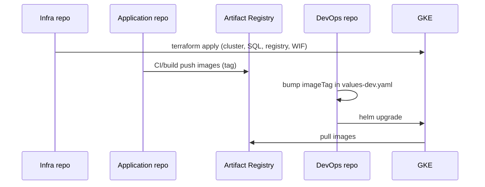

# Connecting the three repos (Application ↔ DevOps ↔ Infra)

Repos are **separate on GitHub** but connect through **GCP**, **naming contracts**, and **Helm values** — not through git submodules.

```text
┌─────────────────────┐     Docker images      ┌─────────────────────┐
│ gke-retail-         │ ─────────────────────► │ Artifact Registry   │
│ application         │   {registry}/{name}:tag│ (GCP project)       │
└─────────────────────┘                        └──────────┬──────────┘
                                                            │
┌─────────────────────┐     helm upgrade                  │
│ gke-retail-devops   │ ◄── uses imageRegistry + imageTag ──┘
│ (Helm chart)        │
└──────────┬──────────┘
           │ deploys to
           ▼
┌─────────────────────┐     cluster, SQL, VPC, WIF
│ GKE + Cloud SQL     │ ◄── gke-retail-infra (Terraform)
│ (runtime)           │
└─────────────────────┘
```

---

## 1. Infra first (platform team)

**Repo:** `gke-retail-infra`

Delivers the shared platform:

| Output | Used by |
|--------|---------|
| GCP `project_id`, region | Everyone |
| GKE cluster `retail-dev` | DevOps `kubectl` / Helm |
| Cloud SQL connection name | DevOps `values-*.yaml` → `global.cloudSql` |
| Workload GSA email | DevOps chart → `global.serviceAccount.gsaEmail` |
| Artifact Registry repo `retail` | App push + DevOps `global.imageRegistry` |
| GitHub WIF | CI in **application** + **devops** + **infra** repos |

After apply:

```bash
./scripts/tf.sh dev gke output
./scripts/tf.sh dev cloudsql output
```

DevOps copies those into `helm/retail-platform/values-dev.yaml` (already aligned for `ai-rag-agent-project` in this project).

---

## 2. The naming contract (App ↔ DevOps)

This is the **main integration** between Application and DevOps teams.

| Application repo | DevOps / Helm |
|------------------|---------------|
| Folder `services/bff-api-service/` | Chart entry `name: bff-api-service` |
| Docker image tag | `global.imageTag` or per-service `tag` in `services.automobile-10.yaml` |
| Image pushed to | `{imageRegistry}/bff-api-service:{tag}` |

Helm template (DevOps repo):

```yaml
image: "{{ .Values.global.imageRegistry }}/{{ .name }}:{{ .Values.global.imageTag }}"
```

**Rule:** service folder name = Kubernetes service name = image repository name.

Automobile demo: use chart file `services.automobile-10.yaml` — names must match the 10 services in the application repo.

---

## 3. Application team → images (build & push)

**Repo:** `gke-retail-application`

From a machine with `gcloud` + Docker:

```bash
cd ~/Projects/gke-retail-application
export PROJECT_ID=ai-rag-agent-project
export REGION=asia-south1

# Build all service Dockerfiles and push to Artifact Registry
# (script lives in DevOps repo — clone both side by side)
export APPLICATION_ROOT="$HOME/Projects/gke-retail-application"
cd ~/Projects/gke-retail-devops
./scripts/build-all-images.sh
```

Or build one service:

```bash
cd ~/Projects/gke-retail-application
REGISTRY="asia-south1-docker.pkg.dev/ai-rag-agent-project/retail"
docker build -f services/bff-api-service/Dockerfile -t "${REGISTRY}/bff-api-service:1.0.1" .
docker push "${REGISTRY}/bff-api-service:1.0.1"
```

**Application CI (recommended next step):** on merge to `main`, workflow builds changed services and pushes `{registry}/{service}:{git-sha}`.

---

## 4. DevOps team → deploy (Helm)

**Repo:** `gke-retail-devops`

After images exist in Artifact Registry:

1. Set tag in values (example dev):

   ```yaml
   # helm/retail-platform/values-dev.yaml
   global:
     imageTag: "1.0.1"   # match what App team pushed
   ```

2. Connect to cluster (from Infra):

   ```bash
   gcloud container clusters get-credentials retail-dev \
     --region asia-south1 --project ai-rag-agent-project
   ```

3. Deploy:

   ```bash
   ./scripts/helm-deploy.sh dev
   # or automobile 10:
   helm upgrade --install retail-dev helm/retail-platform \
     -f helm/retail-platform/values.yaml \
     -f helm/retail-platform/values-dev.yaml \
     -f helm/retail-platform/services.automobile-10.yaml
   ```

DevOps **does not** need the application source on the cluster — only **image URLs** in Helm.

---

## 5. Database (DevOps ↔ Application)

| Environment | Source of truth | Who applies |
|-------------|-----------------|-------------|
| **Local dev** | `db/migrations/` copy in **application** repo | `pnpm setup` |
| **GCP (Cloud SQL)** | `db/migrations/` in **devops** repo | DBA / DevOps job or manual `psql` via proxy |

Application services expect the schema from those SQL files (env: `DB_HOST`, `DB_*`).

Infra creates the **Cloud SQL instance**; DevOps/Application run **migrations** against it.

---

## 6. End-to-end release flow (teams)



1. **Infra:** platform ready, outputs documented.  
2. **Application:** merge → build → push images with agreed tag.  
3. **DevOps:** update `imageTag` (or per-service tags) → `helm-deploy` / GitHub Actions.  
4. **Verify:** Gateway URL, BFF `/health/live`, storefront.

---

## 7. Optional: automate handoff (later)

| Pattern | What happens |
|---------|----------------|
| **Manual (now)** | App team posts image tag in Slack/PR; DevOps updates `values-*.yaml` |
| **`repository_dispatch`** | App CI finishes → triggers DevOps workflow with `image_tag` input |
| **Same tag = git SHA** | App pushes `:abc1234`; DevOps sets `global.imageTag: abc1234` via workflow input |
| **GitHub Environments** | `dev` / `prod` secrets on **each** repo; WIF from Infra `github_wif` stack |

Use one GCP project and one registry so **no cross-repo secrets** are needed beyond WIF + project id.

---

## 8. Quick checklist

- [ ] Infra applied; GKE + Cloud SQL + Artifact Registry exist  
- [ ] DevOps `values-dev.yaml`: `projectId`, `imageRegistry`, `cloudSql`, `gsaEmail` match Infra  
- [ ] Application images pushed: `{imageRegistry}/{service-name}:{tag}`  
- [ ] DevOps `imageTag` matches pushed tag  
- [ ] Helm deploy succeeded; pods `Running`  
- [ ] Migrations applied on Cloud SQL (devops `db/migrations`)

---

## Clone layout (developers)

```bash
mkdir -p ~/Projects && cd ~/Projects
git clone https://github.com/sadaf-jamal-au27/gke-retail-application.git
git clone https://github.com/sadaf-jamal-au27/gke-retail-devops.git
git clone https://github.com/sadaf-jamal-au27/gke-retail-infra.git
```

Set once:

```bash
export APPLICATION_ROOT="$HOME/Projects/gke-retail-application"
```

See also: [`MULTI_REPO.md`](MULTI_REPO.md), [`INFRA_SETUP.md`](INFRA_SETUP.md), [`runbooks/RUNBOOK-HELM.md`](runbooks/RUNBOOK-HELM.md).
