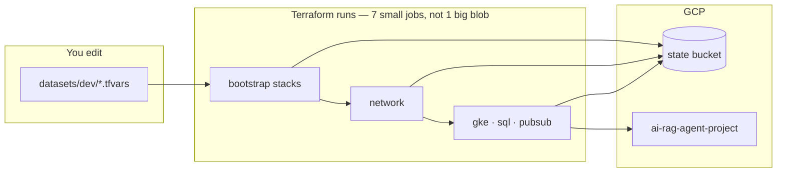

# Infra — simple mental model (FAST without the jargon)

Google’s **Fabric FAST** is a huge **org-wide** landing zone (many folders, many projects, JSON tfvars flying between stages). **This repo is not that.** We kept the **folder names** (`0-bootstrap`, `modules`, …) but scaled it down to **one GCP project per environment** (dev/qa/prod). Think **“FAST-shaped, retail-sized.”**

---

## What you actually touch

| Folder | You? | What it is |
|--------|------|------------|
| **`infra/fast/datasets/dev/`** | **Yes — edit here** | Project ID, region, CIDRs, SQL tier, WIF repos, etc. |
| **`infra/fast/modules/`** | Sometimes | Reusable Terraform (VPC, GKE, SQL). Change when adding a capability. |
| **`infra/fast/stages/`** | **Rarely** | Thin wrappers + wiring. **Generated** — don’t put secrets or env values here. |
| **`infra/fast/backends/`** | **No** | Generated GCS state paths. Regenerate if `state_bucket` changes. |
| **`infra/scripts/tf.sh`** | Run it | One command per stack: `init` / `plan` / `apply`. |

Everything else (CI, WIF scripts, branch rules) wraps the same idea: **change values in `datasets/`, run Terraform in order.**

---

## One picture



**Why 7 plans in CI?** Each box is its **own Terraform project** with its **own state file** in GCS (`dev/gke/`, `dev/network/`, …). That’s normal for staged infra — not 7 random scripts.

---

## Order (memorize this line)

```text
APIs → storage/WIF → network → GKE → Cloud SQL → Pub/Sub
```

(`cloudrun` is optional later.)

**Platform stacks (GKE, SQL, Cloud Run)** use Terraform `try()` + `module { count = … }` so **plan does not fail** before `network` is applied — they plan **0 resources** until dependencies exist in remote state. After **`network apply`**, re-plan shows real GKE/SQL changes.

### First apply (order matters)

```bash
export TF_VAR_database_password='your-dev-password'
./infra/scripts/tf.sh dev project_services apply
./infra/scripts/tf.sh dev cloud_storage apply
./infra/scripts/tf.sh dev github_wif apply
./infra/scripts/tf.sh dev network apply
# then gke, cloudsql, pubsub plan/apply work
```

---

## Day-to-day commands

```bash
# First time only — state bucket
./infra/scripts/gcp-bootstrap.sh dev

export TF_VAR_database_password='your-dev-password'
./infra/scripts/tf-plan-all.sh dev

# One stack only
./infra/scripts/tf.sh dev network plan
```

PRs: GitHub runs **fmt / validate / test**, then **remote plan**. **Merge to `develop`/`main`** runs **Infra Terraform Apply** (when `infra/**` changed). Manual re-run: Actions → **Infra Terraform Apply**.

---

## Fabric vs this repo (one table)

| | Full Fabric FAST | This repo |
|---|------------------|-----------|
| Size | Organization | Single project / env |
| How stacks talk | Auto tfvars in GCS | `terraform_remote_state` |
| What “FAST” means here | Naming + staged apply | Same discipline, **much less** surface area |

---

## When it feels too complex

1. **Ignore** `stages/` and `backends/` until you change a module interface — run `node infra/scripts/generate-fast-stages.mjs` after that.
2. **Read** only `datasets/dev/env.tfvars` + the stack you care about (e.g. `gke.tfvars`, `service_account.tfvars`).
3. **Deep detail** — [`FAST_STRUCTURE.md`](FAST_STRUCTURE.md) (reference, not bedtime reading).

---

## Related

- [`BRANCHING.md`](BRANCHING.md) — develop / main / PR flow  
- [`INFRA_SETUP.md`](INFRA_SETUP.md) — bootstrap & apply phases  
- [`PLATFORM_GUIDE.md`](PLATFORM_GUIDE.md) — full platform narrative  
