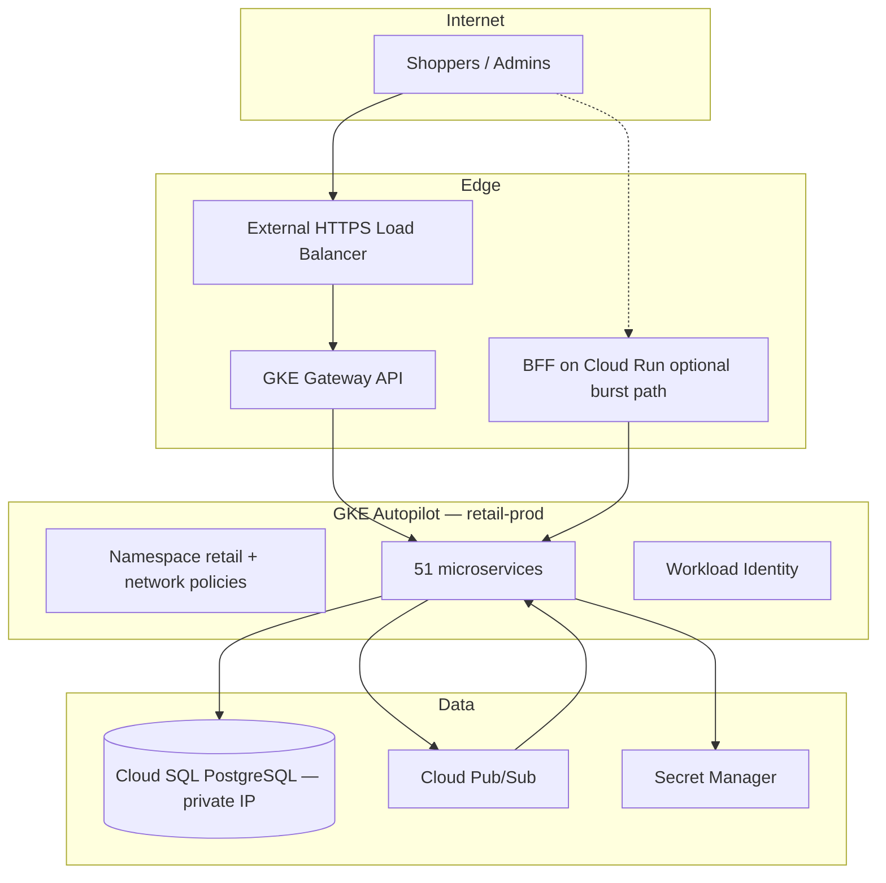

# Retail Platform on GKE — Architecture

Enterprise retail microservices platform designed for client demos, production-grade security patterns, and Helm-based GitOps deployment on Google Kubernetes Engine (GKE) with Cloud SQL, Pub/Sub, Cloud Run, and **GKE Gateway API**.

## High-level topology



## Domain boundaries (51 services)

| Domain | Services | Responsibility |
|--------|----------|----------------|
| **identity** | auth, user, role, session | Authentication, RBAC, sessions |
| **catalog** | product, category, brand, inventory, warehouse, pricing, promotion, coupon, search, media | Merchandising & stock |
| **commerce** | cart, checkout, order, fulfillment, payment, refunds, invoice, tax | Transaction path |
| **fulfillment** | shipping, delivery, pickup, store-locator, returns, exchange | Last-mile & reverse logistics |
| **supply** | supplier, procurement | B2B supply chain |
| **customer** | profile, loyalty, wishlist, reviews, ratings, recommendations | CRM & personalization |
| **engagement** | notifications, email, sms, push, gift cards, subscriptions | Outreach |
| **content** | CMS | Marketing content |
| **platform** | analytics, reporting, fraud, audit, webhooks, integration hub | Observability & integrations |
| **edge** | bff-api | Aggregated API for web/mobile |

## Request flow (storefront checkout)

1. React storefront calls **BFF** (`bff-api-service` or Cloud Run BFF) over HTTPS.
2. BFF orchestrates **cart → checkout → payment → order** via internal ClusterIP services.
3. **order-service** persists to **Cloud SQL** and publishes `order.placed` to Pub/Sub.
4. **notification-service**, **fulfillment-service**, and **analytics-event-service** consume events asynchronously.
5. **GKE Gateway API** exposes only BFF + selected public APIs; all other services are cluster-internal.

## Security model

- **Private GKE cluster** with authorized networks and private nodes.
- **Cloud SQL** private IP + **Cloud SQL Auth Proxy** sidecar on DB-backed pods.
- **Workload Identity** — no long-lived JSON keys in pods.
- **NetworkPolicies**: default deny; allow ingress from `ingress-nginx`/Gateway namespace and same-domain pods.
- **Pod Security**: restricted baseline, non-root containers, read-only root FS where possible.
- **Gateway API** TLS termination at Google-managed certs; HTTP→HTTPS redirect.
- **Rate limiting** at Fastify layer; Cloud Armor recommended on external LB (see `docs/security/SECURITY-AUDIT.md`).
- **Audit**: structured logs → Cloud Logging; `audit-log-service` for domain audit trail events.

## Repository layout

```
apps/storefront, apps/admin     # React (Vite)
packages/service-core           # Shared Fastify + PG + Pub/Sub
services/*                      # 51 generated microservices
platform/helm/retail-platform   # Umbrella Helm chart
infra/terraform                 # GKE, VPC, Cloud SQL, Pub/Sub, Cloud Run
docs/                           # Architecture, runbooks, security
```

## Deployment sequence

1. `terraform apply` — VPC, GKE, Cloud SQL, Pub/Sub topics, Artifact Registry, Cloud Run BFF.
2. Build & push images: `./scripts/build-all-images.sh`
3. Run DB migrations: `platform/db/migrations`
4. `helm upgrade --install retail platform/helm/retail-platform -f platform/helm/retail-platform/values-prod.yaml`
5. Apply Gateway API manifests: `kubectl apply -f platform/k8s/gateway/`

See [RUNBOOK-DEPLOY.md](../runbooks/RUNBOOK-DEPLOY.md) for step-by-step commands.
